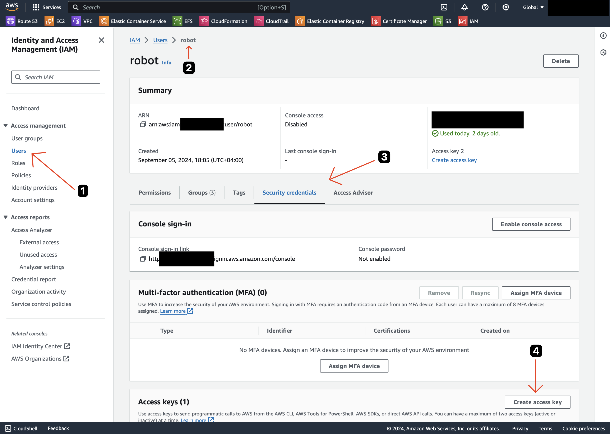
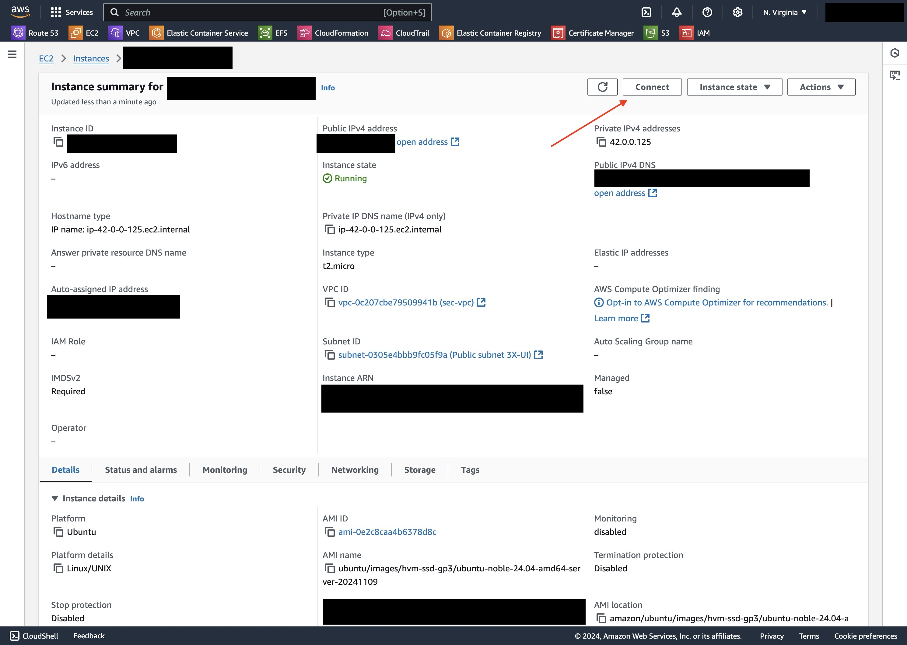
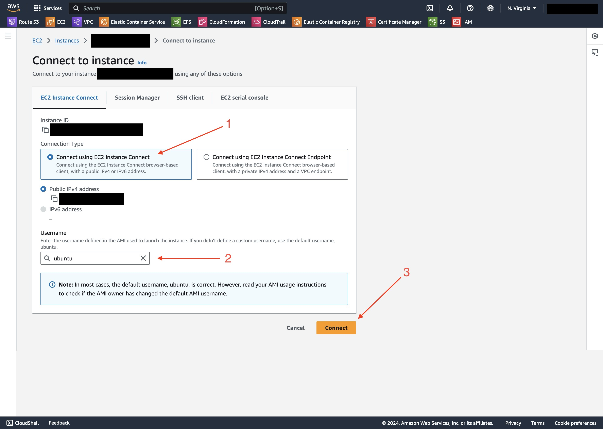

This project is currently focused on deploying VPN servers to Amazon Web Services.
At this moment it supports [OpenVPN](https://openvpn.net/) and [3x-ui](https://github.com/MHSanaei/3x-ui).

# Sec VPC

🔐 Secure VPC for personal needs. Helps you create your own VPN server in a separate VPC in a few simple steps. 

🏗 Like [Crash CDK] (https://github.com/hex22a/crash-cdk) but in [Terraform](https://www.terraform.io/)!

💸 Suits for [AWS Free Tier](https://aws.amazon.com/free/) instances

☀️ Fast, but verbose setup

👯‍ Mostly copy-pasting 

💥 Easy to destroy

## Project structure

```
3x-iu/
    |main.tf
    |post_install.tf
    |servers.tf
    |variables.tf
OpenVPN/
    |config-local.json
    |main.tf
    |servers.tf
    |startup.sh
main.tf
varibles.tf
```

## How it works?

Root main.tf creates a separate VPC in AWS with 1 [Internet Gateway](https://docs.aws.amazon.com/vpc/latest/userguide/VPC_Internet_Gateway.html) and 1 [Route Table](https://docs.aws.amazon.com/vpc/latest/userguide/VPC_Route_Tables.html). In order to deploy VPN instances you need to run terraform from a corresponding directory. These pieces of infrastructure depend on main.tf from the root directory. 

## Pre-requirements

🚜 Tarraform. [tfswitch](https://github.com/warrensbox/terraform-switcher) is recomended to manage Terraform versions

🧾 [AWS](https://aws.amazon.com/) Account

🚜 [AWS CLI](https://docs.aws.amazon.com/cli/latest/userguide/cli-chap-install.html)

💾 [AWS S3 bucket to store tfstate](https://developer.hashicorp.com/terraform/language/backend/s3)

🤖 [IAM User](https://console.aws.amazon.com/iam/home#/users):

Create an IAM user (as opposed to root user) in your AWS account and give it permissions for your S3 bucket.
For purposes of this tutorial we're going to call it `robot`. **Note!** Although you can attach polices directly to IAM users it's not a best practice. Attach polices to the User Groups and then add users to those groups instead.

Get AWS access key for the user



Make sure you saved both **Access key** and **Secret access key** because those values are going to be shown only once.

#### Policy example:

```json
{
  "Version": "2012-10-17",
  "Statement": [
    {
      "Sid": "VisualEditor0",
      "Effect": "Allow",
      "Action": [
        "ec2:AuthorizeSecurityGroupIngress",
        "ec2:DeleteSubnet",
        "ec2:DescribeInstances",
        "ec2:DescribeInstanceAttribute",
        "ec2:CreateVpc",
        "ec2:AttachInternetGateway",
        "ec2:DescribeVpcAttribute",
        "ec2:DeleteRouteTable",
        "ec2:ModifySubnetAttribute",
        "ec2:AssociateRouteTable",
        "ec2:DescribeInternetGateways",
        "ec2:DescribeNetworkInterfaces",
        "ec2:CreateRoute",
        "ec2:CreateInternetGateway",
        "ec2:RevokeSecurityGroupEgress",
        "ec2:CreateSecurityGroup",
        "ec2:DescribeVolumes",
        "ec2:ModifyVpcAttribute",
        "ec2:DeleteInternetGateway",
        "ec2:DescribeRouteTables",
        "ec2:AuthorizeSecurityGroupEgress",
        "ec2:TerminateInstances",
        "ec2:DescribeVpcClassicLinkDnsSupport",
        "ec2:DescribeTags",
        "ec2:CreateTags",
        "ec2:CreateRouteTable",
        "ec2:RunInstances",
        "ec2:ModifySecurityGroupRules",
        "ec2:DetachInternetGateway",
        "ec2:DisassociateRouteTable",
        "ec2:DescribeInstanceCreditSpecifications",
        "ec2:DescribeSecurityGroups",
        "ec2:DescribeVpcClassicLink",
        "ec2:RevokeSecurityGroupIngress",
        "ec2:DescribeImages",
        "ec2:DescribeSecurityGroupRules",
        "ec2:DescribeVpcs",
        "ec2:DeleteSecurityGroup",
        "ec2:DescribeInstanceTypes",
        "ec2:DeleteVpc",
        "ec2:CreateSubnet",
        "ec2:DescribeSubnets"
      ],
      "Resource": "*"
    }
  ]
}
```


## Configure AWS CLI

```bash
aws configure
```

The tool will prompt for an IAM credentials. Fill in ones, created before.

## Deploy

### Sec VPC

```bash
# Make sure you're on correct version of terraform
tfswich

# Init terraform state
terraform init -backend-config="bucket=YOR_BUCKET_NAME" -backend-config="region=us-east-1"

# Plan your infra
terraform plan

# Deploy
tarraform apply
```

### 3x-ui

```bash
# jump into correct directory
cd ./3x-ui

# Init terraform state
terraform init -backend-config="bucket=YOR_BUCKET_NAME" -backend-config="region=us-east-1"

# Plan your infra
terraform plan

# Deploy
tarraform apply
```

#### Connect to instance

Go to AWS EC2 Console and find your 3x-ui instance. Open instance details and click "Connect"



Make sure "Connect using EC2 Instance Connect" is selected and username is "ubuntu"



If everything is done correctly you should successfully connect to a remote instance

#### 3x-ui

Follow steps from [3x-ui](https://github.com/MHSanaei/3x-ui) to install it

#### post_install.tf

In order to access Web UI you need to change contents of **post_install.tf** to match ports.

```bash
terraform apply
```

Do the same after crating an Inbound in 3x-ui. 

### OpenVPN

```bash
# jump into correct directory
cd ./OpenVPN

# Init terraform state
terraform init -backend-config="bucket=YOR_BUCKET_NAME" -backend-config="region=us-east-1"

# Plan your infra
terraform plan

# Deploy
tarraform apply
```

#### Get the admin password

Go to AWS EC2 Console and find your OpenVPN instance. Open instance details and click "Connect"


Make sure "Connect using EC2 Instance Connect" is selected and username is "ubuntu"


If everything is done correctly you should successfully connect to a remote instance

```bash
# One you connected to the instance output the content of /usr/local/openvpn_as/init.log and look for openvpn default superuser password
sudo cat /usr/local/openvpn_as/init.log
```

💭 **Important 3**
__Don't forget to change your admin password after first login!__

Instance configuration is complete 🎉

#### Set up VPN

##### Server

Log in as  `openvpn` user at `https://PUBLIC_IP/admin`. Ignore SSL warning, or add SSL Cert as trusted to the keychain. You can find your public ip in [AWS Console](https://console.aws.amazon.com/). To bypass Google Chrome's "Not Secure" warning, just type in "thisisunsafe" while the tab is open. 

Update __Hostname or IP Address__ at __Network Settings__ (https://PUBLIC_IP/admin/network_settings). Value in the field should be your PUBLIC_IP.

Create 👩‍💻 VPN users, click "More Settings" to set password, enable auto-login

__Don't forget to "Update Running Server"__

##### Client

Login as a 👩‍💻 VPN user [https://PUBLIC_IP/?src=connect](https://PUBLIC_IP/?src=connect)

Download client app if you haven't yet

Click `Yourself (autologin profile)` to download `client.ovpn` file. Use this file to establish your custom VPN connection.

## 🚨 Destroy

```bash
terraform destroy
```

## Troubleshooting

Useful commands:

```bash
aws ec2 describe-images --region us-east-1 --filters "Name=name,Values=*24.04*" "Name=architecture,Values=x86_64" --owners 099720109477 --max-items 10
```

```bash
aws ec2 describe-images --region eu-west-2 --filters "Name=architecture,Values=x86_64" "Name=root-device-type,Values=ebs" "Name=virtualization-type,Values=hvm" "Name=name,Values=*al2023*" --query 'sort_by(Images, &CreationDate)[-1].[ImageId, Name, CreationDate]' --owners 137112412989 --max-items 10
```

```bash
aws ec2 describe-images --region us-east-1 --filters "Name=name,Values=RHEL-9.4.0_HVM-*-x86_64-*-GP3" "Name=architecture,Values=x86_64" "Name=root-device-type,Values=ebs" "Name=virtualization-type,Values=hvm" --owners 309956199498 --max-items 10
```


If You're getting following error:
```
Unrecognized option or missing or extra parameter(s) in configuration: (line 4): dhcp-pre-release (2.4.4)
``` 

If you're configuring WiFi router with `.ovpn` autologin profile like above, try adding following lines to the `.ovpn` file in your favorite text editor

```
## Add this right after comments block, just for better arrangemnt
pull-filter ignore "dhcp-pre-release"
pull-filter ignore "dhcp-renew"
pull-filter ignore "dhcp-release"
pull-filter ignore "register-dns"
pull-filter ignore "block-ipv6"
```


If you're having issues with SSH make sure your time in local machine is set to automatic.

